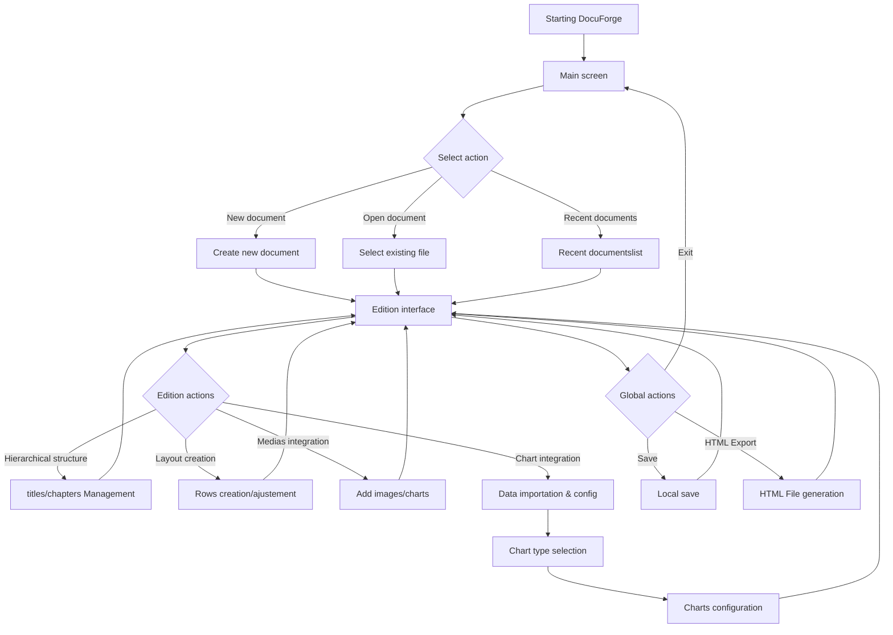

# docuForge
A tool to create/edit/export documents with image and charts integration of your own data from CSV/excel/JSON...

## User flow

```mermaid
graph TD
    A[Starting DocuForge] --> B[Main screen]
    B --> C{Select action}
    C -->|New document| D[Create new document]
    C -->|Open document| E[Select existing file]
    C -->|Recent documents| F[Recent documentslist]
    D --> G[Edition interface]
    E --> G
    F --> G
    G --> H{Edition actions}
    H -->|Hierarchical structure| I[titles/chapters Management]
    H -->|Layout creation| J[Rows creation/ajustement]
    H -->|Medias integration| K[Add images/charts]
    H -->|Chart integration| L[Data importation & config]
    I --> G
    J --> G
    K --> G
    L --> M[Chart type selection]
    M --> N[Charts configuration]
    N --> G
    G --> O{Global actions}
    O -->|Save| P[Local save]
    O -->|HTML Export| Q[HTML File generation]
    O -->|Exit| B
    P --> G
    Q --> G
```
