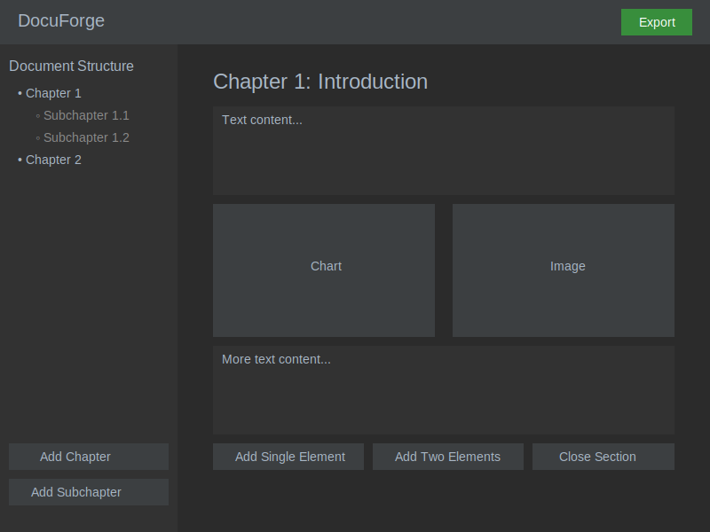

# docuForge
A tool to create/edit/export documents with image and charts integration of your own data from CSV/excel/JSON...

## User flow

## Chart Insertion and Configuration

**This flow outlines the step-by-step process a user follows when inserting a chart :**
- Initiate chart insertion
- Choose chart type
- Upload data
- Validate data format
- Map data to chart properties
- Preview and adjust as needed
- Confirm and insert into document

This intuitive process ensures users can easily create data visualizations that adhere to Edward Tufte's principles, enhancing the overall quality of their documents.

## Component Diagram

**Component Description**
1. Frontend (React + TypeScript)
  - UI Components: React components for the user interface
  - State Management: Handles local state with React Hooks and global state with Context API
  - Chart Rendering: Uses D3.js or Recharts for data visualization
2. Wails v2 Bridge
  - API Bindings: Facilitates communication between the frontend and backend
3. Backend (Go)
  - Business Logic: Handles core application logic
  - File System Operations: Manages reading and writing of files
  - Data Processing: Processes data for charts and document structure
  - HTML Export: Generates HTML output for documents
4. Data Storage
  - SQLite: Stores document data and application state

**Key Interactions**
- The frontend communicates with the backend through the Wails v2 API bindings
- The backend handles all data processing and storage operations
- Chart rendering in the frontend uses processed data from the backend
- Document export is managed by the backend with input from the frontend

This architecture ensures a clear separation of concerns, with the frontend handling user interactions and presentation, while the backend manages data processing, storage, and core business logic.

## DocuForge UI Wireframe

**Main screen**

**Dataset to charts link settings**
